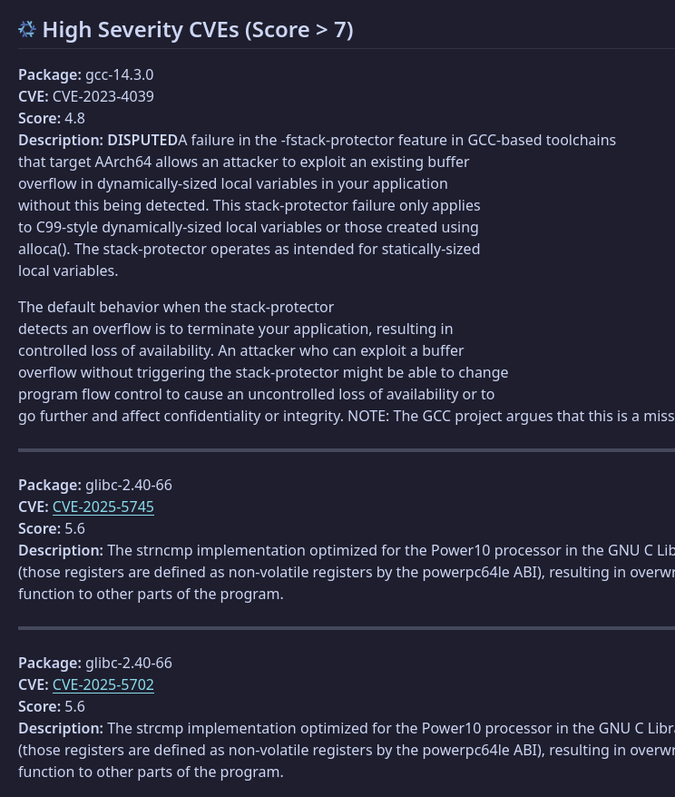

# vulnix action

Action to run [vulnix](https://github.com/nix-community/vulnix) and throw an error if there is a score above `score`.

Also creates a nice github step summary:



## Usage

```yaml
- name: Build
  run: nix build -o result

- name: Run vulnix
  uses: spotdemo4/vulnix-action@main
  with:
    path: result
    score: 7
```

## Inputs

### path

path to scan (defaults to entire system)

### score

minimum CVE score to report

